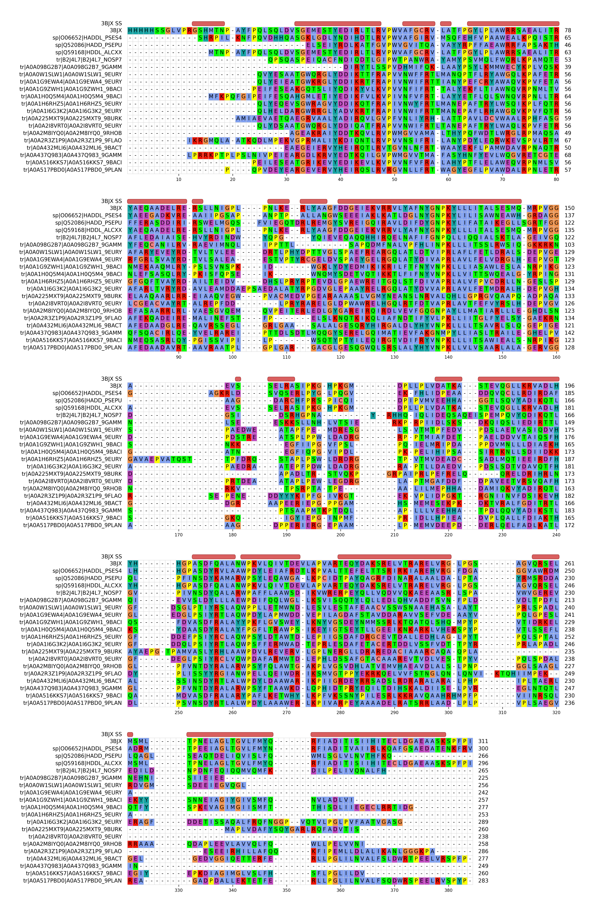

## Summary

The configuration-inverting 2-haloacid dehalogenase DehI has two structurally
similar regions of approximately 130 amino acids. This analysis tests whether
the two regions retain detectable sequence homology consistent with an ancient
tandem duplication and fusion.

The N- and C-terminal regions were defined using the experimentally determined
DehI structure 3BJX, extracted from a 69-sequence family alignment, converted
into separate HH-suite profile hidden Markov models, and compared using
HHalign. The profiles align over nearly their entire lengths with **99.54%
HHalign probability**, an **E-value of 2.9 × 10^-23^**, and **17% direct
sequence identity**. The combination of low identity, strong profile-profile
support, and broad alignment coverage is consistent with remote homology
between the two DehI repeats.

Broad CMD-like and AhpD profiles produced no statistically convincing match to
either DehI half. The compact CMD proteins were therefore divided into
sequence-coherent monomer subfamilies before profile construction. This
revealed reproducible but sub-threshold signals: the strongest were
**DehI-N/CMD_monomer_017 at 87.72% probability** and
**DehI-N/CMD_monomer_015 at 85.88%**. CMD_monomer_015 also matched DehI-C at
**80.99% over 64 columns**. The first three corrected P-values remain below
0.001 after a conservative correction across 54 comparisons, but none reaches the usual
≥95% HH-suite probability expected for a confident assignment.

A separate architecture analysis found **11 CMD-like and 4 AhpD proteins with
two non-overlapping core matches**, all 186–210 residues rather than the
anticipated 120–150 residues. DehI-C versus that intact CMD double-core profile
reached only **12.95% probability**. Thus the intact monomeric CMD unit is the
more promising hypothesis in these data, although the relationship remains
suggestive rather than established.

::: {.callout-important title="Principal result"}
The N- and C-terminal profiles align across 108 columns: 88% of the N-terminal
model and 96% of the C-terminal model. This is a domain-scale match rather than
a short conserved motif.
:::

::: {.callout-warning title="External-family result"}
The current sequence-only profiles strongly support DehI internal duplication.
The monomer-subfamily analysis supplies a credible DehI-to-CMD lead, especially
CMD_monomer_015, but does **not yet establish** that relationship. Independent
profile-database and structure-based tests are needed before treating it as a
positive family assignment.
:::

## Biological question

DehI from *Pseudomonas putida* PP3 is an unusual α-helical dehalogenase with a
deep Stevedore knot. Its monomer contains two regions with closely similar
structures but low pairwise sequence identity. The original structural study
described two approximately 130-residue domains with about 16% sequence
identity ([PDB 3BJX](https://www.rcsb.org/structure/3BJX);
[DOI: 10.1016/j.jmb.2008.02.035](https://doi.org/10.1016/j.jmb.2008.02.035)).
A later topology analysis interpreted these regions as likely products of
tandem sequence duplication and described the proline-rich arc connecting them
([King *et al.*, 2010](https://doi.org/10.1371/journal.pcbi.1000731)).

The specific question addressed here is:

> Does a profile-profile comparison of the DehI N- and C-terminal families
> recover statistically strong, domain-scale sequence homology after the linker
> is excluded?

A second, exploratory question asks whether either DehI repeat retains a
detectable relationship to free-standing carboxymuconolactone decarboxylase
(CMD)-like or alkyl hydroperoxide reductase D (AhpD) proteins, specifically
after distinguishing single CMD cores from tandem duplication products.

## Analysis design

```{mermaid}
flowchart LR
    A[DehI family<br>core MSA] --> B[Map 3BJX<br>structural boundary]
    B --> C[N-terminal MSA<br>residues 1–129]
    B --> D[C-terminal MSA<br>residues 162–296]
    B -.-> E[Exclude linker<br>residues 130–161]
    C --> F[N-terminal HHM]
    D --> G[C-terminal HHM]
    F --> H[HHalign<br>profile–profile comparison]
    G --> H
    I[CMD-like<br>PF02627 profile] --> J[Four external<br>comparisons]
    K[AhpD<br>IPR004674 profile] --> J
    F --> J
    G --> J
    I --> L[49-state CMD-core HMM]
    K --> L
    L --> M[Require two<br>non-overlapping hits]
    M --> N[Double-core profiles]
    N --> J
```

The workflow deliberately separates computation from presentation. Alignment
splitting and HH-suite profile construction are performed by version-controlled
scripts. This document reads the resulting files; it does not rerun HH-suite
during website rendering.

## Family alignment and structural reference

The input was the 69-sequence aligned FASTA file
[`dehi_core_msa.fasta`](results/dehi_core_msa.fasta). The first record is the
3BJX chain-A reference. Its aligned sequence contains a 15-residue recombinant
N-terminal expression tag followed by native DehI residues 1–296.

| Property | Value |
|---|---:|
| Family sequences | 69 |
| Alignment columns | 384 |
| 3BJX aligned residues | 311 |
| 3BJX expression-tag residues | 15 |
| 3BJX native residues | 296 |

: Input family-alignment summary. {#tbl-input-summary}

### Secondary-structure context

The deposited `HELIX` records from 3BJX were mapped through the gaps in the
3BJX alignment row. Red rounded bars denote helices. The figure shows the first
20 family members for legibility; the domain splitting and HHM construction use
all 69 sequences.

{#fig-msa-ss fig-alt="Wrapped DehI multiple-sequence alignment with the 3BJX secondary structure displayed as red helix bars above each block." width=100%}

## Defining and extracting the repeats

The last long helix of the N-terminal repeat ends at 3BJX residue 129. A
proline-rich region occupies residues 130–161, and the next repeat begins at
residue 162 with a short 3~10~ helix followed by the first long C-terminal
helix. The linker is therefore 32 residues by these structure-defined bounds,
corresponding to the approximately 30-residue linker described informally.

| Region | Native 3BJX residues | Treatment |
|---|---:|---|
| N-terminal repeat | 1–129 | Retained |
| Proline-rich linker | 130–161 | Excluded |
| C-terminal repeat | 162–296 | Retained |

The boundaries were mapped from native 3BJX residue numbers to MSA columns.
The same columns were then extracted from every family member. All-gap columns
were removed independently from each resulting alignment. The procedure is
implemented in [`split_dehi_msa.py`](split_dehi_msa.py).

| Region | 3BJX residues | Source MSA columns | Output columns | Sequences |
|---|---:|---:|---:|---:|
| N | 1–129 | 16–154 | 139 | 69 |
| Linker excluded | 130–161 | 155–217 | — | — |
| C | 162–296 | 218–384 | 167 | 69 |

: Structure-guided split of the DehI family alignment. {#tbl-split-summary}

The N-terminal output has 139 aligned columns and the C-terminal output has
167. The ungapped 3BJX fragments contain 129 and 135 residues, respectively.
All 69 input records are represented in both outputs.

## HH-suite profile construction

HH-suite was chosen because HHalign directly compares profile HMMs and is
designed to detect remote protein homology through alignment-to-alignment or
HMM-to-HMM comparison
([HH-suite documentation](https://github.com/soedinglab/hh-suite);
[Steinegger *et al.*, 2019](https://doi.org/10.1186/s12859-019-3019-7)).

Each split FASTA alignment was converted to A3M format. A column was designated
as a match state when fewer than 50% of sequences contained a gap (`-M 50`).
Columns not meeting this condition were represented as insert states. HHmake
then applied its standard sequence filtering and weighting before constructing
each HHM.

```bash
reformat.pl fas a3m results/dehi_N_terminal_msa.fasta \
  results/dehi_N_terminal.a3m -M 50
reformat.pl fas a3m results/dehi_C_terminal_msa.fasta \
  results/dehi_C_terminal.a3m -M 50

hhmake -i results/dehi_N_terminal.a3m \
  -o results/dehi_N_terminal.hhm -name DehI_N_terminal
hhmake -i results/dehi_C_terminal.a3m \
  -o results/dehi_C_terminal.hhm -name DehI_C_terminal
```

| Profile | Match states | Sequences retained | Effective sequences |
|---|---:|---:|---:|
| DehI N-terminal | 123 | 68/69 | 5.5 |
| DehI C-terminal | 113 | 68/69 | 6.0 |

: Properties of the two HH-suite profiles. {#tbl-profile-summary}

HHmake retained 68 of 69 sequences in each model after its default redundancy
and quality filters. The effective sequence counts (`Neff`) of 5.5 and 6.0 are
much smaller than the raw sequence count because related sequences do not
contribute as independent observations.

## N-terminal versus C-terminal HHalign result

The two precomputed HHMs were compared directly:

```bash
hhalign \
  -i results/dehi_N_terminal.hhm \
  -t results/dehi_C_terminal.hhm \
  -o results/dehi_N_vs_C.hhr \
  -Oa3m results/dehi_N_vs_C.a3m \
  -atab results/dehi_N_vs_C.tsv
```

| Metric | Value |
|---|---:|
| HHalign probability | 99.54% |
| E-value | 2.9 × 10^-23^ |
| Profile score | 124.39 bits |
| Aligned columns | 108 |
| Direct identity | 17% |
| Profile similarity | 0.123 |
| Sum of posterior probabilities | 94.6 |
| N-profile coverage | 87.8% |
| C-profile coverage | 95.6% |

: HHalign profile-profile comparison. {#tbl-hhalign-summary}

The alignment spans N-profile match states 5–113 and C-profile match states
2–112. It therefore covers most of both models rather than selecting a small
highly conserved segment. The 17% direct identity lies in the range where
pairwise sequence comparison alone is generally difficult, while the profile
score remains strong because residue preferences and gap patterns are
aggregated across the family.

### Profile-profile alignment

The following is the consensus and 3BJX portion of the HHalign output. Digits in
the `Confidence` lines are posterior alignment confidence on a 0–9 scale.

```text
Q 3BJX       12 QLDVSGEMESTYEDIRLTLRVPWVAFGCRVLATFPGYLPLAWRR.SAEALITRYAEQAADELRERSLLNIGPLPNL-K-E 88 (129)
Q Consensus   5 e~eA~g~~~~vY~DIk~tLrVP~Vn~ifRtlA~yp~fl~~~W~~.~rP~~~T~~fe~aA~~lR~~~~~~~~~~~~~-~-~ 81 (123)
                +.++.+.++++|+|||+++|.|.||..+|+||+||+||..+|+. +||..+|.+|++++++++..+...+...+-+ . .
T Consensus   2 ~~~~~~~~~~l~~dI~~~h~~~~v~SdYR~LA~wP~~L~~~W~~.LkP~i~s~~y~~~~~~l~~~A~~~v~~lP~~v~l~ 80 (113)
T 3BJX        2 ATKASTEVQGLLKRVADLHYHHGPASDFQALANWPKVLQIVTDEvLAPVARTEQYDAKSRELVTRARELVRGLPGSAGVQ 81 (135)
Confidence      56889999999999999999999999999999999999999999 9999999999999999999888877765332 1 1

Q 3BJX       89 --RLYAAGFDDGEIEKVRRVLYAFNYGNPKYLL 119 (129)
Q Consensus  82 ~-~~~~~~~~~~~~~~ir~~l~~f~~vnPklLl 113 (123)
                 . .+.+.+ ++.++++|.+.+..|...-|-++|
T Consensus  81 ~~~L~~~~-~~~~i~~i~~l~~~F~~~lp~Lil 112 (113)
T 3BJX       82 RSELMSML-TPNELAGLTGVLFMYQRFIADITI 113 (135)
Confidence      1 555555 899999999999999988877654
```

## Comparison with CMD-like and AhpD proteins

### Defining the reference families

The external comparisons use two UniProt-derived, 60%-identity-reduced source
sets already present in the project. These labels need care. Pfam PF02627 is
named for CMD but represents the broader AhpD/CMD-like fold; bona fide AhpD
proteins can also carry PF02627. The two groups below are therefore
**operational sequence sets**, not mutually exclusive fold classifications.
This relationship is independently reflected in the domain annotation of an
[AhpD example (UniProt P9WQB4)](https://www.uniprot.org/uniprotkb/P9WQB4/entry),
the [HAMAP AhpD rule](https://hamap.expasy.org/rule/MF_01676), and the
[2OUW structural annotations](https://www.rcsb.org/annotations/2OUW).

- **CMD-like:** PF02627 records explicitly annotated as
  `carboxymuconolactone decarboxylase`, excluding descriptions containing
  `AhpD`, and restricted to 80–220 residues to reduce fragments and fusions.
- **AhpD:** records from the more specific IPR004674 source set, restricted to
  120–230 residues.

| Profile set | Source records | Retained before HHmake | Length range | HHmake retained | Match states | Neff |
|---|---:|---:|---:|---:|---:|---:|
| CMD-like | 12,656 | 7,266 | 80–220 | 104 | 124 | 9.4 |
| AhpD | 178 | 172 | 120–229 | 121 | 175 | 4.2 |

: Construction of the external-family profiles. {#tbl-external-profiles}

Two non-standard residues in the CMD-like set were converted to `X`; none
were converted in the AhpD set. Selection and normalization are implemented in
[`prepare_cmd_ahpd_comparison.py`](prepare_cmd_ahpd_comparison.py). The
retained sequences were aligned independently with MAFFT FFT-NS-1, converted
to A3M with the same `-M 50` match-state rule as the DehI halves, and passed to
HHmake. The complete pipeline is in
[`build_cmd_ahpd_hhsuite_profiles.sh`](build_cmd_ahpd_hhsuite_profiles.sh).

### HHalign comparison matrix

Each row is a direct comparison of two precomputed profiles. Because exactly
one target was supplied in each run, the E-values are useful for comparing
these pre-specified runs but are not calibrated to a large database search.

| Query | Template | Probability | E-value | Score | Aligned columns | Identity | Query coverage | Template coverage |
|---|---|---:|---:|---:|---:|---:|---:|---:|
| DehI-N | DehI-C | **99.54%** | 2.9 × 10^-23^ | 124.39 | 108 | 17% | 87.8% | 95.6% |
| DehI-N | CMD-like | 0.21% | 0.28 | 9.46 | 10 | 30% | 8.1% | 8.1% |
| DehI-C | CMD-like | 0.14% | 0.42 | 8.08 | 1 | 0% | 0.9% | 0.8% |
| DehI-N | AhpD | 0.23% | 0.26 | 12.12 | 21 | 24% | 17.1% | 12.0% |
| DehI-C | AhpD | **4.12%** | **0.01** | **19.65** | **72** | 15% | 63.7% | 41.1% |
| CMD-like | AhpD | **97.04%** | **8.3 × 10^-11^** | **55.41** | 43 | 26% | 34.7% | 24.6% |

: Internal and broad-family HHalign results. Bold marks the established
internal match, the strongest broad-family DehI/external lead, and the
external-family control. {#tbl-comparison-matrix}

The DehI-N/C result is qualitatively distinct from all four external
comparisons: it combines near-certain probability, an extremely small E-value,
and near-domain-scale coverage. DehI-C/AhpD is the only external comparison
with appreciable span, aligning C-profile states 34–106 to AhpD states 9–87.
Its probability remains very low, however, and the aligned region is rich in
generic helical-protein preferences. It should therefore be treated as a
hypothesis for structural and database-search follow-up rather than as evidence
of common ancestry.

### Best broad-family exploratory alignment: DehI-C versus AhpD

```text
Q 3BJX       34 NWPKVLQIVTDEVLAPVARTEQYDAKSRELVTRARELVRGLP-GSAGVQRSELMSMLTPNELA------GLTGVLFMYQRF 107
Q Consensus  34 ~wP~~L~~~W~~~LkP~i~s~~y~~~~~~l~~~A~~~v~~lP-~~v~l~~~~L~~~~~~~~i~------~i~~l~~~F~~~ 106
                .-|+|...+.-. |+..++++.......-....|...+.+-| .-..+..+. +...++++++      .+|+.-..|.| |
T Consensus   9 ~lP~yAKDlklN~l~~vl~~~~Lt~~q~~g~aLA~A~a~r~~~l~~ai~~eA-~~~ls~~~~~aA~aaAslMaMNNVyYRf  87
```

This 72-column match has 15% identity and a sum of posterior probabilities of
37.5. It is visually plausible, but HHalign assigns only 4.12% probability;
the statistical assessment, rather than visual resemblance alone, governs the
interpretation.

### CMD-like versus AhpD control

CMD-like and AhpD align at 97.04% probability over a 43-state core. This is
consistent with their shared broader classification and shows that the
external profiles retain a detectable common signal. It is not a fully
independent positive control, because the CMD-like PF02627 umbrella overlaps
conceptually with AhpD/CMD-like proteins even after annotation-based
separation.

## Monomer-focused CMD analysis

### Why a subfamily analysis was needed

The broad PF02627 alignment combines many divergent CMD-like lineages. A
profile averaged across that entire set can lose a relationship retained in
only one lineage. The 1,316 intact, explicitly CMD-annotated proteins of
80–119 residues were therefore clustered with MMseqs2 at **30% sequence
identity and 70% bidirectional coverage**. This produced 160 clusters. The 27
clusters containing at least five proteins were retained for profile analysis;
the smaller clusters do not contain enough sequences to support a useful
family HMM.

Each retained cluster was aligned independently with MAFFT and converted to an
HH-suite profile. Both DehI halves were compared with every cluster, giving 54
pairwise tests. The complete ranking, including cluster sizes, effective
sequence counts, model lengths and coverage, is available as the
[monomer-cluster result table](results/dehi_vs_cmd_monomer_clusters.tsv), with
cluster composition in the
[cluster manifest](results/cmd_monomer_cluster_manifest.tsv). The workflow is
implemented in
[`build_cmd_monomer_cluster_profiles.sh`](build_cmd_monomer_cluster_profiles.sh).

### Lead monomer-subfamily matches

| DehI query | CMD cluster (representative) | Sequences | Profile Neff | Probability | Pairwise P-value | P × 54 | Aligned columns | Query / CMD coverage | Identity |
|---|---|---:|---:|---:|---:|---:|---:|---:|---:|
| N-terminal | [017 (A0ABY7GUB4)](results/cmd_monomer_clusters/dehi_N_vs_CMD_monomer_017.hhr) | 9 | 2.9 | **87.72%** | 3.4 × 10^-6^ | 1.84 × 10^-4^ | 42 | 34% / 52% | 12% |
| N-terminal | [015 (A0ABP8DVF7)](results/cmd_monomer_clusters/dehi_N_vs_CMD_monomer_015.hhr) | 10 | 3.4 | **85.88%** | 5.3 × 10^-6^ | 2.86 × 10^-4^ | 48 | 39% / 45% | 17% |
| C-terminal | [015 (A0ABP8DVF7)](results/cmd_monomer_clusters/dehi_C_vs_CMD_monomer_015.hhr) | 10 | 3.4 | **80.99%** | 1.2 × 10^-5^ | 6.48 × 10^-4^ | 64 | 57% / 60% | 23% |
| C-terminal | [003 (A0A8A7KB27)](results/cmd_monomer_clusters/dehi_C_vs_CMD_monomer_003.hhr) | 117 | 5.3 | **74.52%** | 2.7 × 10^-5^ | 1.46 × 10^-3^ | 78 | 69% / 70% | 17% |

: Highest-scoring DehI comparisons among the 27 intact CMD monomer profiles.
The P × 54 column is a conservative Bonferroni correction across both halves
and all retained clusters. {#tbl-cmd-monomer-leads}

These results are much stronger than the pooled CMD profile, showing that
subfamily stratification was important. CMD_monomer_015 is especially
interesting because the same external profile gives the leading match to both
homologous DehI halves. Its C-terminal comparison also spans
more than half of both models. Cluster 003 gives the broadest alignment, but at
74.52% probability it is the least secure of the four leads.

The three lead CMD clusters are themselves homologous at profile level:

| CMD profile comparison | Probability | E-value | Aligned columns | Identity |
|---|---:|---:|---:|---:|
| [015 vs 017](results/cmd_monomer_clusters/CMD_monomer_015_vs_017.hhr) | 98.85% | 3.8 × 10^-17^ | 79 | 28% |
| [015 vs 003](results/cmd_monomer_clusters/CMD_monomer_015_vs_003.hhr) | 98.60% | 8.7 × 10^-16^ | 77 | 22% |
| [017 vs 003](results/cmd_monomer_clusters/CMD_monomer_017_vs_003.hhr) | 96.00% | 4.3 × 10^-9^ | 40 | 20% |

: Post-hoc profile comparisons among the three CMD subfamilies that produced
the leading DehI matches. {#tbl-cmd-lead-relatedness}

Their mutual profile similarity argues that the signals arise from a coherent
region of CMD sequence space rather than three unrelated annotations. However,
the lead clusters were selected after inspecting the DehI comparisons, so this
cross-comparison is a consistency check rather than independent confirmation.

::: {.callout-warning title="Interpretation of the monomer signal"}
The corrected P-values show that these alignments are unlikely to be ordinary
pairwise chance scores within this 54-test experiment. HH-suite probability
also incorporates whether a match resembles true homologues rather than common
background alignments, and the maximum here is 87.72%, below the conventional
high-confidence range. The short 42–48-column N-terminal matches and modest
profile diversity (Neff 2.9–3.4) are additional reasons to describe the result
as **suggestive evidence**, not a family assignment.
:::

## Duplication-aware CMD/AhpD refinement

### Why length alone is insufficient

Structural work on TTHA0727 showed that the conserved CMD core comprises three
helices and that an AhpD monomer contains a structural duplication of this
core. The AhpD trimer consequently corresponds to the hexamer formed by
single-core CMD-family subunits
([Nakamura *et al.*, 2006](https://pubmed.ncbi.nlm.nih.gov/16597838/)). This
provides a mechanistic reason to compare DehI with fused CMD-core duplication
products. It does not, however, mean that every protein of roughly twice the
core length is duplicated.

Two complementary tests were therefore applied:

1. An architecture scan required two significant, non-overlapping CMD-core
   matches in the same protein.
2. A separate 120–150-residue cohort test asked whether midpoint-split N and C
   half profiles show the internal similarity expected from duplication.

### Building the single-core detector

The detector was built entirely in the project `uv` environment using
PyHMMER. From the PF02627 set, 1,316 explicitly CMD-annotated proteins of
80–119 residues were treated as compact single-copy-like seeds. Structural
studies place the three-helix CMD core in the C-terminal portion of these
six-helix proteins, so the C-terminal 55% of each seed was aligned. Columns
occupied in at least half the sequences defined a **49-state profile HMM**.

Longer CMD-like and AhpD proteins of 120–210 residues were scanned with this
model. A high-confidence duplication call required:

- two domain matches with independent E-values ≤ 10^-3^;
- at least 45% coverage of the 49-state model by each match; and
- no more than 10 residues of overlap between the matches.

These are deliberately conservative sequence criteria. They identify a
high-confidence subset, not every structural duplication in the superfamily.
The method and thresholds are versioned in
[`identify_cmd_ahpd_duplications.py`](identify_cmd_ahpd_duplications.py).

| Group | Candidates scanned | Two-core proteins | Protein lengths | Mean length | Mean repeat-1 length | Mean repeat-2 length |
|---|---:|---:|---:|---:|---:|---:|
| CMD-like | 5,748 | 11 | 186–210 | 196.8 | 48.1 | 44.9 |
| AhpD | 169 | 4 | 191–199 | 195.3 | 25.0 | 37.5 |

: High-confidence sequence-detected CMD-core duplication products.
{#tbl-double-core-selection}

The shorter AhpD match lengths reflect partial profile coverage at the
conservative detection threshold; they should not be interpreted as complete
structural-repeat boundaries. Exact coordinates and per-domain E-values are in
the [architecture table](results/cmd_ahpd_duplication_architectures.tsv).

### Internal validation of the inferred repeats

The extracted first and second matches were converted into separate HH-suite
profiles and compared with HHalign.

| Cohort | Probability | E-value | Aligned columns | Identity | Interpretation |
|---|---:|---:|---:|---:|---|
| CMD two-core: repeat 1 vs repeat 2 | **98.84%** | **4.8 × 10^-17^** | 40 | 20% | Strong profile support for internal duplication |
| AhpD two-core: repeat 1 vs repeat 2 | 0.63% | 0.091 | 14 | 14% | Four sequences and partial matches are insufficient for profile validation |
| CMD 120–150 midpoint halves | 0.06% | 0.73 | 1 | 0% | No cohort-level duplication signal |
| AhpD 120–150 midpoint halves | 0.43% | 0.14 | 13 | 23% | Only four proteins; no supported signal |

: Tests of internal repeat similarity. {#tbl-repeat-validation}

The strong CMD repeat-1/repeat-2 result validates the architecture detector for
that subset. Conversely, the large 120–150-aa CMD cohort does **not** behave as
a family of midpoint-fused homologous repeats. This does not rule out isolated
compact duplications with shifted or rearranged boundaries, but it shows that
selecting this whole length class would create a misleading comparison.

### Duplication-aware comparison with DehI halves

The selected proteins were kept intact when building the external profiles;
the repeat fragments were used only to establish the architecture. This tests
the proposed correspondence between one intact DehI half and one fused
double-core CMD/AhpD unit.

| DehI query | Double-core template | Probability | E-value | Score | Aligned columns | Identity |
|---|---|---:|---:|---:|---:|---:|
| N-terminal | CMD-like | 0.06% | 0.79 | 8.47 | 9 | 44% |
| C-terminal | CMD-like | **12.95%** | **0.0022** | **23.49** | **50** | 18% |
| N-terminal | AhpD | 0.18% | 0.33 | 11.69 | 19 | 16% |
| C-terminal | AhpD | 1.11% | 0.048 | 16.14 | 59 | 15% |

: HHalign results against intact, sequence-detected double-core proteins.
{#tbl-duplication-aware-comparison}

The C-terminal DehI/CMD double-core comparison improves substantially over the
broad CMD result (12.95% versus 0.14% probability) and spans 50 columns.
Nevertheless, 12.95% remains weak HHalign support, the alignment covers less
than half of either complete architecture, and only 11 CMD proteins contribute
to the selected external set. It is therefore an interesting directional
signal rather than evidence of homology.

::: {.callout-note title="What happened to the expected 120–150-aa fusions?"}
No 120–150-aa protein passed the conservative two-hit CMD-core scan, and the
midpoint-split profiles of that length class did not align. The high-confidence
sequence-detected duplication products in these datasets are instead about
190–200 residues. Structure-based domain boundaries may recover additional
compact cases that have diverged beyond recognition by this 49-state sequence
profile.
:::

## Interpretation

Three features make this result supportive of internal homology:

1. **High profile probability.** HHalign assigns a 99.54% probability to the
   N/C relationship.
2. **Domain-scale coverage.** The 108 aligned columns cover 88% of the N model
   and 96% of the C model.
3. **Remote rather than trivial similarity.** Direct identity is only 17%, yet
   conserved residue patterns remain detectable when information is combined
   across 69 family members.

Together with the near-identical structural folds reported for 3BJX, this is
consistent with the proposal that an ancestral domain duplicated in tandem and
the two copies subsequently diverged while remaining fused in DehI.

The external comparisons do not yet identify the ancestral domain definitively.
However, separating intact CMD monomers into coherent subfamilies changes the
picture: three related CMD profiles give probabilities of 74.52–87.72%, and
CMD_monomer_015 matches both DehI halves. This makes a monomeric CMD relationship
the strongest current external hypothesis. Because the probabilities remain
below 95%, the most defensible conclusion is: **strong evidence for internal
DehI N/C homology and suggestive, but not yet conclusive, evidence connecting
those repeats to a subset of monomeric CMD proteins.** No comparable
sequence-only support was recovered for AhpD.

::: {.callout-note title="What the result does not prove"}
HHalign measures compatibility between two profile models. It does not by
itself date the duplication, identify the ancestral free-standing family, or
exclude every alternative evolutionary scenario. Structural correspondence,
taxonomic distribution, conserved catalytic residues, and comparisons with
external families provide independent evidence.
:::

### Statistical qualification

Only one template HMM was searched (`Searched_HMMs 1`). Consequently, the
reported E-value and P-value are identical (`2.9 × 10^-23^`); this is not an
E-value corrected for a large profile database. The probability, score, and
especially the broad alignment coverage remain directly informative for this
pre-specified N-versus-C comparison.

Secondary structure was not included in the HHalign score (`SS = 0`, reported
as `missing dssp`). This makes the profile match a sequence-derived result
rather than one driven by the known structural similarity.

## Robustness checks and next analyses

The following tests would strengthen the evolutionary interpretation:

- Rebuild both profiles after removing 3BJX and repeat the comparison, ensuring
  that the structural reference is not driving the result.
- Repeat profile construction with match-state thresholds of 30%, 50%, and 70%
  gaps and compare the aligned cores.
- Search both DehI profiles against the same broad, curated HH-suite database
  and test whether their strongest domain-level matches overlap. A database
  search supplies the calibration and competing alternatives absent from these
  one-template HHalign runs.
- Build structure-informed profiles for CMD and AhpD, or compare representative
  structures with Foldseek/DALI. This is the most direct follow-up for the weak
  but improved DehI-C/CMD double-core alignment and for compact duplications
  that a sequence-only core HMM may miss.
- Split or cluster the heterogeneous PF02627 set before alignment. The current
  annotation and length filters produce an interpretable first-pass profile,
  but PF02627 spans substantial functional diversity.
- Map conserved aligned profile positions back onto the 3BJX structure and
  determine whether they occupy corresponding structural environments.

## Reproducibility and downloads

The report uses precomputed HH-suite output so that the website can be rendered
without installing native bioinformatics software. The Python dependencies are
managed by `uv`; HH-suite 3 is required only when regenerating the profiles.

### Scripts

- [`split_dehi_msa.py`](split_dehi_msa.py) — map the 3BJX boundaries through
  the family MSA and extract both repeats.
- [`build_dehi_hhsuite_profiles.sh`](build_dehi_hhsuite_profiles.sh) — convert
  the alignments to A3M, construct both HHMs, and run HHalign.
- [`prepare_cmd_ahpd_comparison.py`](prepare_cmd_ahpd_comparison.py) — define,
  filter, and normalize the operational CMD-like and AhpD sequence sets.
- [`build_cmd_ahpd_hhsuite_profiles.sh`](build_cmd_ahpd_hhsuite_profiles.sh) —
  align both external families, construct their HHMs, and run all five external
  profile comparisons.
- [`identify_cmd_ahpd_duplications.py`](identify_cmd_ahpd_duplications.py) —
  construct the 49-state PyHMMER core detector, require two non-overlapping
  hits, and extract the inferred repeats.
- [`build_cmd_ahpd_duplication_profiles.sh`](build_cmd_ahpd_duplication_profiles.sh)
  — run the duplication detector, validate repeat profiles, and perform the
  duplication-aware DehI comparisons.

### Alignments and sequences

- [Full DehI core MSA](results/dehi_core_msa.fasta)
- [N-terminal aligned FASTA](results/dehi_N_terminal_msa.fasta)
- [C-terminal aligned FASTA](results/dehi_C_terminal_msa.fasta)
- [N-terminal ungapped FASTA](results/dehi_N_terminal.fasta)
- [C-terminal ungapped FASTA](results/dehi_C_terminal.fasta)
- [N-terminal A3M](results/dehi_N_terminal.a3m)
- [C-terminal A3M](results/dehi_C_terminal.a3m)
- [CMD-like A3M](results/cmd_PF02627_nr60.a3m)
- [AhpD A3M](results/ahpd_IPR004674_nr60.a3m)
- [PF02627 source sequences (nr60)](results/uniprot_PF02627_nr60.fasta)
- [IPR004674 AhpD source sequences (nr60)](results/uniprot_ahpd_IPR004674_nr60.fasta)
- [High-confidence CMD double-core proteins](results/cmd_double_core.fasta)
- [High-confidence AhpD double-core proteins](results/ahpd_double_core.fasta)

### Profiles and comparison output

- [N-terminal HHM](results/dehi_N_terminal.hhm)
- [C-terminal HHM](results/dehi_C_terminal.hhm)
- [HHalign report](results/dehi_N_vs_C.hhr)
- [HHalign pairwise A3M](results/dehi_N_vs_C.a3m)
- [HHalign per-column table](results/dehi_N_vs_C.tsv)
- [Domain-splitting report](results/dehi_terminal_split_report.tsv)
- [CMD-like profile HHM](results/cmd_PF02627_nr60.hhm)
- [AhpD profile HHM](results/ahpd_IPR004674_nr60.hhm)
- [DehI-N versus CMD-like report](results/dehi_N_vs_CMD.hhr)
- [DehI-C versus CMD-like report](results/dehi_C_vs_CMD.hhr)
- [DehI-N versus AhpD report](results/dehi_N_vs_AhpD.hhr)
- [DehI-C versus AhpD report](results/dehi_C_vs_AhpD.hhr)
- [CMD-like versus AhpD report](results/CMD_vs_AhpD.hhr)
- [External-family filtering summary](results/cmd_ahpd_comparison_sets.tsv)
- [49-state CMD-core PyHMMER model](results/cmd_single_core_seed.hmm)
- [Double-core architecture calls and coordinates](results/cmd_ahpd_duplication_architectures.tsv)
- [CMD double-core HHM](results/cmd_double_core.hhm)
- [AhpD double-core HHM](results/ahpd_double_core.hhm)
- [CMD inferred repeat-1 versus repeat-2 report](results/CMD_repeat1_vs_repeat2.hhr)
- [AhpD inferred repeat-1 versus repeat-2 report](results/AhpD_repeat1_vs_repeat2.hhr)
- [CMD 120–150 midpoint validation](results/CMD_compact_repeat1_vs_repeat2.hhr)
- [AhpD 120–150 midpoint validation](results/AhpD_compact_repeat1_vs_repeat2.hhr)
- [DehI-N versus CMD double-core report](results/dehi_N_vs_CMD_double_core.hhr)
- [DehI-C versus CMD double-core report](results/dehi_C_vs_CMD_double_core.hhr)
- [DehI-N versus AhpD double-core report](results/dehi_N_vs_AhpD_double_core.hhr)
- [DehI-C versus AhpD double-core report](results/dehi_C_vs_AhpD_double_core.hhr)

To regenerate the derived files locally:

```bash
uv run python split_dehi_msa.py
./build_dehi_hhsuite_profiles.sh
uv run python prepare_cmd_ahpd_comparison.py
./build_cmd_ahpd_hhsuite_profiles.sh
./build_cmd_ahpd_duplication_profiles.sh
quarto render report.qmd
```
